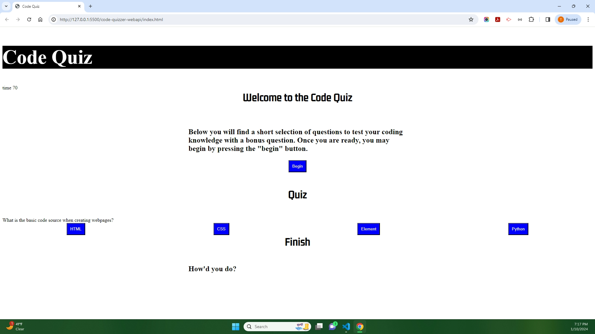

## Code Quizzer

## Description

-The motitvation was to create a fun quiz to test a beginner's knowledge
-This website was built as a rough draft to a better type of quiz page in the future
-This website will solve the issue of rebuilding templates from scratch.
-I learned that the issue of using vanilla javascript does not work well with the legacy javascript at all. Also creating elements and hiding at specific points in time is very difficult to understand.

## Screenshots

## Webpages

Deployed site- https://brazz26.github.io/code-quizzer-webapi/

Github repo clone-  Brazz26/code-quizzer-webapi